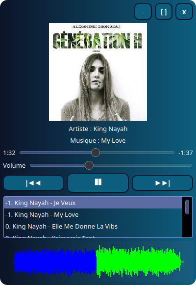
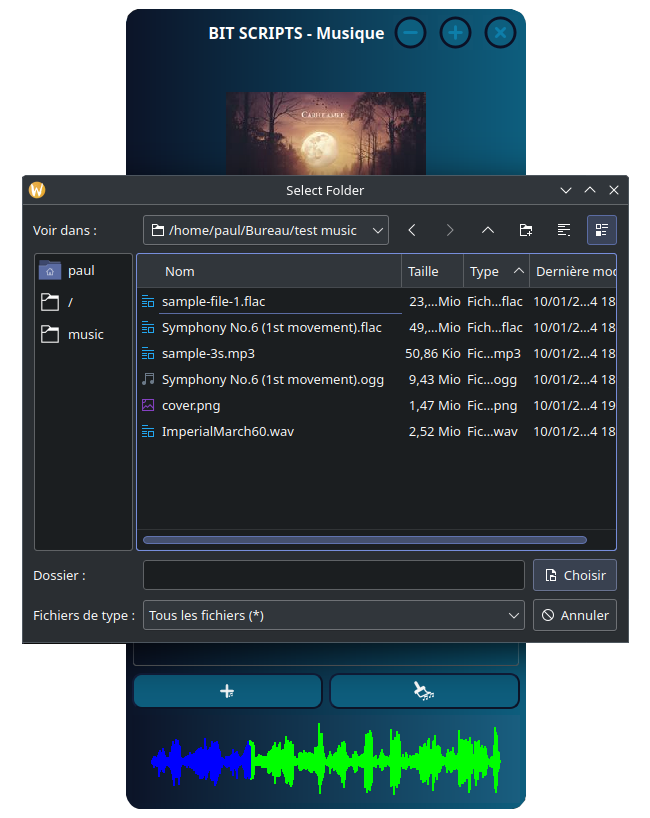
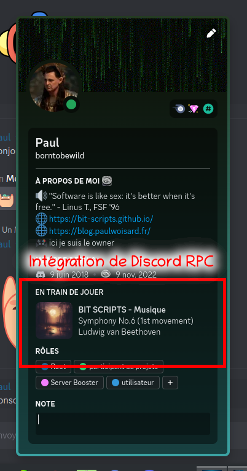

# BIT-SCRIPTS<br/>Musique

Petit lecteur de musique écrit en Python et sans prétention.   
  
For the English version of this documentation page, click [here](./README-en.md).  
  
## Table des Matières
- [Capture d'écran de l'application](#capture-décran-de-lapplication)
- [Fonctionnalités](#fonctionnalités)
- [Prérequis](#prérequis)
- [Installation](#installation)
- [Utilisation](#utilisation)
- [Intégration de Discord RPC](#intégration-de-discord-rpc)
- [Personnalisation](#personnalisation)
- [Contribution](#contribution)
- [Questions Fréquentes et Dépannage](#questions-fréquentes-et-dépannage)
- [Licence](#licence)
- [Contacts](#contacts)

## Capture d'écran de l'application
### Design du lecteur :  
    
### Ajout de musique :  
  
### En action :   
https://github.com/Bit-Scripts/musique/assets/22844238/d0c22e06-2d05-4f93-a2ca-5435c50c4171  
### Discord RPC :  
  

## Fonctionnalités
- Lecture de fichiers audio au format MP3, WAVE, OGG ou encore FLAC.
- Contrôle simple avec des boutons pour jouer/pauser, passer à la chanson suivante ou revenir à la précédente.
- Affichage de la forme d'onde de la chanson en cours.
- Barre de progression indiquant le temps écoulé de la chanson.
- Fonctionnalité de volume réglable.
- Interface utilisateur personnalisée avec des boutons de contrôle de la fenêtre (minimiser, maximiser, fermer).
## Prérequis
Pour exécuter ce lecteur de musique, assurez-vous d'avoir installé les éléments suivants :

### Pour tous les systèmes :
- [Python 3.x](https://www.python.org/downloads/) (non nécessaire si vous utilisez le binaire)
- [PyQt5](https://pypi.org/project/PyQt5/) (non nécessaire si vous utilisez le binaire)
- [Pygame](https://pypi.org/project/pygame/) (non nécessaire si vous utilisez le binaire)
- [PyDub](https://pypi.org/project/pydub/) (non nécessaire si vous utilisez le binaire)
- [Mutagen](https://pypi.org/project/mutagen/) (non nécessaire si vous utilisez le binaire)
- [Pyqtgraph](https://pypi.org/project/pyqtgraph/) (non nécessaire si vous utilisez le binaire)
- [FFmpeg](https://ffmpeg.org/download.html) **(essentiel pour tous les systèmes)**

### Pour Windows :
- FFmpeg :
  - Vous pouvez installer FFmpeg via l'un des gestionnaires de paquets en ligne de commande suivants :
    - Chocolatey ([Comment installer Chocolatey](https://chocolatey.org/install)) :
      ```
      choco install ffmpeg
      ```
    - Winget ([Comment installer Winget](https://aymeric-cucherousset.fr/installer-winget-sur-windows/)) :
      ```
      winget install ffmpeg
      ```
    - Scoop ([Comment installer Scoop](https://www.useweb.fr/blog/developpement/post/scoop-package-manager/)) :
      ```
      scoop install ffmpeg
      ```
  - Alternativement, vous pouvez télécharger FFmpeg manuellement depuis [le site officiel](https://ffmpeg.org/download.html), l'extraire et ajouter le dossier `bin` à la variable d'environnement `Path`.
  - Vérifiez l'installation avec `ffmpeg -version`.

### Pour Linux :
Les instructions d'installation des dépendances sont fournies pour Ubuntu/Debian et Arch Linux/Manjaro. Si vous utilisez une distribution différente comme par exemple, Fedora ou RHEL, veuillez consulter la documentation de votre distribution pour les instructions spécifiques d'installation de FFmpeg et des autres dépendances requises.
- FFmpeg :
  - Installez FFmpeg en utilisant le gestionnaire de paquets de votre distribution.
    Par exemple, sur Ubuntu/Debian, utilisez :
    ```bash
    sudo apt-get install ffmpeg
    ```
    Ou sur Arch Linux/Manjaro, utilisez :
    ```bash
    sudo pacman -S ffmpeg
    ```
  - Vérifiez l'installation avec `ffmpeg -version`.
- autre dépendances :
  - Installez les autres dépendances en utilisant le gestionnaire de paquets de votre distribution.
    Par exemple, sur Ubuntu/Debian, utilisez :
    ```bash
    sudo apt-get install python3-pyqt5.qtsvg python3-opengl libgirepository1.0-dev
    ```
    Ou sur Arch Linux/Manjaro, utilisez :
    ```bash
    sudo pacman -S python-pyqt5 python-opengl gobject-introspection qt5-wayland qt5-x11extras sdl2 sdl2_image sdl2_mixer sdl2_ttf
    ```
  
## Installation
1. Pour une installation rapide, téléchargez les dernières versions binaires de l'application [ici](https://github.com/Bit-Scripts/musique/releases/latest). Si vous utilisez le binaire, vous n'avez pas besoin d'installer Python ou les autres dépendances, à l'exception de FFmpeg.
2. Pour une installation manuelle, clonez ce dépôt ou téléchargez-le en tant qu'archive ZIP, puis installez les dépendances nécessaires en exécutant pip install -r requirements.txt.
3. Lancez le lecteur en exécutant `python main.py` depuis le répertoire du projet.
  
## Utilisation
Lancez l'application. Vous pourrez charger des fichiers musicaux depuis un dossier de votre choix et contrôler la lecture avec les boutons de l'interface utilisateur.
  
## Intégration de Discord RPC
Pour enrichir l'expérience utilisateur, j'ai implémenté l'affichage de la musique en cours de lecture dans Discord grâce à la fonctionnalité Discord RPC.
Voici un aperçu de l'[intégration de Discord RPC](#discord-rpc-).
  
## Personnalisation
Vous pouvez personnaliser l'apparence de l'application en modifiant les fichiers de style CSS intégrés.

## Contribution
Nous accueillons chaleureusement les contributions à ce projet !  
  
Si vous avez des idées d'amélioration, des corrections de bugs ou souhaitez ajouter de nouvelles fonctionnalités, n'hésitez pas à créer un pull request ou une [issue](https://github.com/Bit-Scripts/musique/issues). 
  
Même si vous êtes nouveau dans le domaine de l'open source, nous serons ravis de vous guider à travers le processus. 
  
Pour commencer, vous pouvez :  
- Forker le projet et tester le code sur votre machine.
- Soumettre des pull requests avec vos modifications ou ajouts.
- Créer des [issues](https://github.com/Bit-Scripts/musique/issues) pour discuter de bugs, de suggestions d'améliorations ou de nouvelles fonctionnalités.
  
Nous nous engageons à lire et répondre à vos demandes.
  
## Questions Fréquentes et Dépannage

### Dans tout les cas
- **Format de musique**  
Q: Quels formats audio mon lecteur de musique peut-il lire ?   
R: Le lecteur supporte les formats MP3, WAVE, OGG et FLAC. Si vous rencontrez des problèmes avec ces formats, assurez-vous d'avoir la dernière version complète de FFmpeg installée.   
  
- **Où sont mes musiques**  
Q: L'application ne trouve pas mes fichiers musicaux.  
R: Vérifiez que les fichiers sont dans un format pris en charge (flac, mp3, ogg ou wav) et que le chemin d'accès est correct. 
  
- **Pochettes d'album**  
Q: L'intégration des pochettes d'album semble ne pas fonctionner.  
R: Les pochettes d'album doivent être au format jpg, jpeg ou png et situées dans le même dossier que les fichiers musicaux.  
  
- **Système d'exploitation supporter par le lecteur audio**  
Q: Sur quel système d'exploitation, je peux utiliser Bit-Scripts Musique ?  
R: À l'heure actuelle, *Bit-Scripts Musique* est disponible pour Microsoft Windows et la majorité des distributions Linux.   
  
- **Problème de ressources**  
Q: Pourquoi le lecteur de musique ralentit ou gèle parfois ?  
R: Cela peut être dû à des ressources système insuffisantes, à des fichiers audio de grande taille ou à des problèmes de compatibilité. Essayez de fermer d'autres applications en cours d'exécution et de réduire la taille de votre bibliothèque musicale. Si le problème persiste, veuillez nous contacter via une isseu, [ici](https://github.com/Bit-Scripts/musique/issues).  
  
- **Problème avec FFmpeg**  
Q: Comment configurer FFmpeg pour qu'il fonctionne avec le lecteur de musique ?  
R: Après avoir installé la version complète de FFmpeg, ajoutez son chemin d'accès à la variable d'environnement Path de votre système. Consultez la documentation de FFmpeg pour plus de détails ou créez une issue [ici](https://github.com/Bit-Scripts/musique/issues) pour obtenir de l'aide.  
  
### Installation depuis les binaires
- **Mise à jour**  
Q: Comment puis-je mettre à jour mon lecteur de musique depuis le **binaire** ?  
R: Visitez la page [releases](https://github.com/Bit-Scripts/musique/releases/latest) pour télécharger la dernière version. Si vous utilisez le binaire, remplacez simplement l'ancien fichier exécutable par le nouveau.
  
### Installation via les fichiers Python 
- **Installation**  
Q: Comment résoudre l'erreur "X" lors de l'installation ?  
R: Assurez-vous que vous avez bien installé toutes les dépendances. Si le problème persiste, n'hésitez pas à créer une [issue sur notre page GitHub](https://github.com/Bit-Scripts/musique/issues). 
  
- **Mise à jour**  
Q: Comment puis-je mettre à jour mon lecteur de musique depuis une copie des **fichiers Python** ?  
R: Effectuer un `git pull` dans le dossier de l'application.  
  
- **Problème lié à l'interface graphique**   
Q: Que faire si l'interface graphique ne s'affiche pas correctement en lançant l'application avec Python ?  
R: Assurez-vous que toutes les dépendances, en particulier PyQt5 et Pyqtgraph, sont correctement installées. Si le problème persiste, essayez de redémarrer l'application ou votre système.  
  
En cas de problème, ouvrez une [issue sur GitHub](https://github.com/Bit-Scripts/musique/issues) et nous nous engageons à résoudre votre problème dans les plus brefs délais (laissez-nous au moins deux semaines, mais le problème sera corrigé).
  
## Licence
Ce projet est sous licence MIT. Voir le fichier [LICENSE](./LICENSE) pour plus de détails.

## Mentions légales et Remerciements
### Icônes
Les icônes utilisées dans cette application proviennent de [Iconduck](https://iconduck.com/sets/iconpark-icon-set/categories/music) et ont été légèrement modifiées pour s'adapter au design de l'application. Nous tenons à remercier Iconduck pour leur travail remarquable et leur contribution à la communauté open-source.

### Contributions
[Red Moon](https://github.com/Quentin-D31) : Un grand merci à Red Moon pour avoir testé l'application sur Arch Linux et pour ses retours précieux qui ont aidé à améliorer l'expérience utilisateur sur différentes plateformes.  
[Paul/Paullux](https://github.com/Paullux) : Pour le développement initial et la maintenance continue du projet. Si vous souhaitez contribuer au projet, n'hésitez pas à créer un pull request ou une issue sur notre [page GitHub](https://github.com/Bit-Scripts).  
  
Nous tenons à remercier tous ceux qui contribuent au succès de ce projet, que ce soit par des tests, des suggestions, des contributions de code ou simplement en partageant le projet avec d'autres.  
  
## Contacts
Dans un but d'amélioration constante du projet, n'hésitez à nous contacter pour nous remonter vos retour(s) ou idée(s) d'amélioration(s).  
  
- Pour échanger avec nous n'hésitez pas à vous rendre sur notre [serveur Discord](https://discord.gg/6J5EX5hCeW) ainsi vous pourriez y poser des questions ou demander de l'aide sur le serveur Discord.    
- Vous pouvez me contacter par Email en cas de besoin, pour cela je vous suggère de passer soit par [Discord](https://discord.gg/6J5EX5hCeW) soit par mon [profil personnel sur github](https://github.com/Paullux) pour obtenir mon adresse Email.  
- Vous aimez ce projet :
Rendez-vous sur notre site, [bit-scripts.github.io](https://bit-scripts.github.io/index.html), pour y trouver nos autres réalisations.
