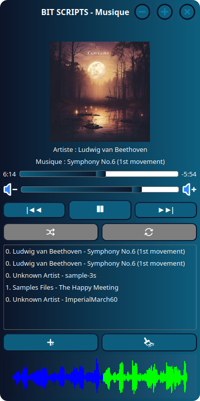

# BIT-SCRIPTS<br/>Musique

Petit lecteur de musique écrit en Python et sans prétention.

## Design du lecteur :
  
## Ajout de musique :


## Table des Matières
- [Fonctionnalités](#fonctionnalités)
- [Prérequis](#prérequis)
- [Installation](#installation)
- [Utilisation](#utilisation)
- [Intégration de Discord RPC](#intégration-de-discord-rpc)
- [Personnalisation](#personnalisation)
- [Contribution](#contribution)
- [FAQ ou Dépannage](#faq-ou-dépannage)
- [Licence](#licence)
- [Contacts](#contacts)

## Fonctionnalités
- Lecture de fichiers audio au format MP3, WAVE, OGG ou encore FLAC.
- Contrôle simple avec des boutons pour jouer/pauser, passer à la chanson suivante ou revenir à la précédente.
- Affichage de la forme d'onde de la chanson en cours.
- Barre de progression indiquant le temps écoulé de la chanson.
- Fonctionnalité de volume réglable.
- Interface utilisateur personnalisée avec des boutons de contrôle de la fenêtre (minimiser, maximiser, fermer).
## Prérequis
Pour exécuter ce lecteur de musique, assurez-vous d'avoir installé les éléments suivants :

### Pour tous les systèmes :
- Python 3.x (non nécessaire si vous utilisez le binaire)
- PyQt5
- Pygame
- PyDub
- Mutagen
- Pyqtgraph
- FFmpeg (essentiel pour tous les systèmes)

### Pour Windows :
- FFmpeg :
  - Vous pouvez installer FFmpeg via l'un des gestionnaires de paquets en ligne de commande suivants :
    - Chocolatey :
      ```
      choco install ffmpeg
      ```
    - Winget (Essentials Build) :
      ```
      winget install "FFmpeg (Essentials Build)"
      ```
    - Winget (Full Build) :
      ```
      winget install ffmpeg
      ```
    - Scoop (Full Build) :
      ```
      scoop install ffmpeg
      ```
    - Scoop (Shared Build) :
      ```
      scoop install ffmpeg-shared
      ```
    - Pour les builds de développement (Git Master) :
      ```
      scoop install ffmpeg-gyan-nightly
      ```
  - Alternativement, vous pouvez télécharger FFmpeg manuellement depuis [le site officiel](https://ffmpeg.org/download.html), l'extraire et ajouter le dossier `bin` à la variable d'environnement `Path`.
  - Vérifiez l'installation avec `ffmpeg -version`.

### Pour Linux :
- FFmpeg :
  - Installez FFmpeg en utilisant le gestionnaire de paquets de votre distribution.
    Par exemple, sur Ubuntu/Debian, utilisez :
    ```bash
    sudo apt-get install ffmpeg
    ```
    Ou sur Arch Linux/Manjaro, utilisez :
    ```bash
    sudo pacman -S ffmpeg
    ```
  - Vérifiez l'installation avec `ffmpeg -version`.
- autre dépendances :
  - Installez les autres dépendances en utilisant le gestionnaire de paquets de votre distribution.
    Par exemple, sur Ubuntu/Debian, utilisez :
    ```bash
    sudo apt-get install python3-pyqt5.qtsvg python3-opengl libgirepository1.0-dev
    ```
    Ou sur Arch Linux/Manjaro, utilisez :
    ```bash
    sudo pacman -S python-pyqt5 python-opengl gobject-introspection qt5-wayland qt5-x11extras sdl2 sdl2_image sdl2_mixer sdl2_ttf
    ```
  
## Installation
1. Pour une installation rapide, téléchargez les dernières versions binaires de l'application [ici](https://github.com/Bit-Scripts/musique/releases/latest). Si vous utilisez le binaire, vous n'avez pas besoin d'installer Python ou les autres dépendances, à l'exception de FFmpeg.
2. Pour une installation manuelle, clonez ce dépôt ou téléchargez-le en tant qu'archive ZIP, puis installez les dépendances nécessaires en exécutant pip install -r requirements.txt.
3. Lancez le lecteur en exécutant python main.py depuis le répertoire du projet.
  
## Utilisation
Lancez l'application. Vous pourrez charger des fichiers MP3 depuis un dossier de votre choix et contrôler la lecture avec les boutons de l'interface utilisateur.
  
## Intégration de Discord RPC
Pour enrichir l'expérience utilisateur, j'ai implémenté l'affichage de la musique en cours de lecture dans Discord grâce à la fonctionnalité Discord RPC.
Voici un aperçu de l'intégration de Discord RPC en action :


## Personnalisation
Vous pouvez personnaliser l'apparence de l'application en modifiant les fichiers de style CSS intégrés.

## Contribution
Les contributions sont les bienvenues. Pour toute demande ou suggestion, n'hésitez pas à créer une [issue](https://github.com/Bit-Scripts/musique/issues) ou un pull request. Nous nous engageons à lire et répondre à vos demandes.

## FAQ ou Dépannage
Q: Comment résoudre l'erreur "X" lors de l'installation ?
R: Assurez-vous que vous avez bien installé toutes les dépendances. Si le problème persiste, n'hésitez pas à créer une [issue sur notre page GitHub](https://github.com/Bit-Scripts/musique/issues).

Q: L'application ne trouve pas mes fichiers musicaux.
R: Vérifiez que les fichiers sont dans un format pris en charge (flac, mp3, ogg ou wav) et que le chemin d'accès est correct. 

Q: L'intégration des pochettes d'album semble ne pas fonctionner.  
R: Les pochettes d'album doivent être au format jpg, jpeg ou png et situées dans le même dossier que les fichiers musicaux.

En cas de problème, ouvrez une [issue sur GitHub](https://github.com/Bit-Scripts/musique/issues) et nous nous engageons à résoudre votre problème dans les plus brefs délais (laissez-nous au moins deux semaines, mais le problème sera corrigé).

## Licence
Ce projet est sous licence MIT. Voir le fichier [LICENSE](./LICENSE) pour plus de détails.

## Contacts
- Pour échanger avec nous n'hésitez pas à vous rendre sur notre [serveur Discord](https://discord.gg/6J5EX5hCeW)

- Vous aimez ce projet :
Rendez-vous sur notre site, [bit-scripts.github.io](https://bit-scripts.github.io/index.html), pour y trouver nos autres réalisations.